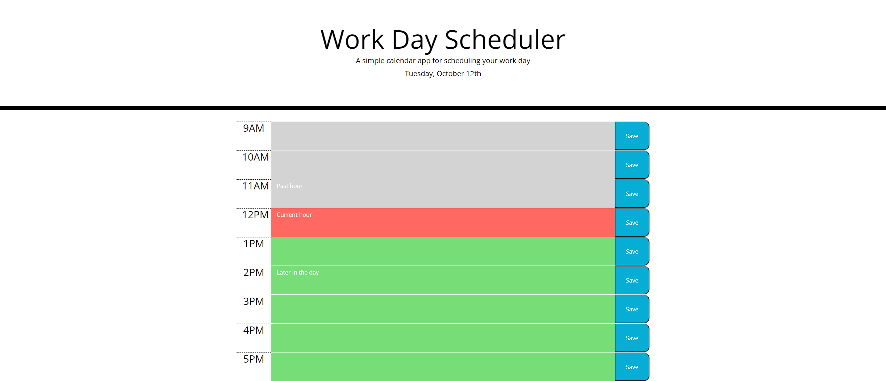

# Homework05_DayPlanner
A web app to plan your busy day using dynamically updating html and css.

## How to use it
Click inside the color boxes, and begin entering your scheduled plans for that time slot, then click the save button. After save your plans you can com back later to view what you've scheduled. (Try by clicking the refresh on your browser)

## What to know when using
Depending on what time of day it is, you may notice the text boxes may appear different colored. The colors show if the time slot is already past(gray), in the current hour(red), or later in the day(green).

# Links

## Deployed project
https://paw6063.github.io/Homework05_DayPlanner/

## Github Repository
https://github.com/PAW6063/Homework05_DayPlanner
